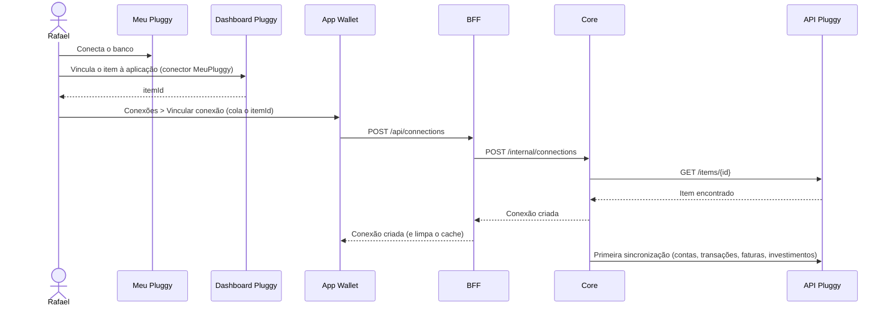
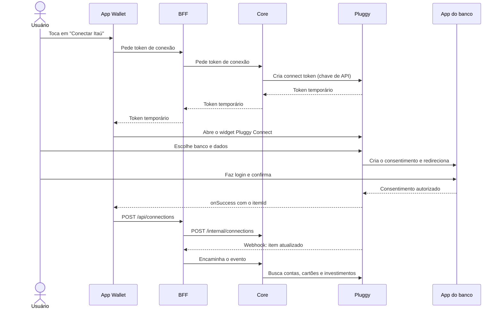

# Fluxo de Conexão

Como uma conta de banco passa a aparecer no Wallet. São dois fluxos, escolhidos por
`wallet.provider.connection-mode` no core.

## Desenvolvimento: Meu Pluggy

Detalhes e limites em [[Meu Pluggy no Desenvolvimento]].

## Produção: widget Pluggy Connect

Nos dois fluxos a última etapa é a mesma: `POST /api/connections` com o `itemId`. Só
muda de onde o ID vem. Regras que o fluxo cumpre: [[Consentimento]]. Onde cada peça
roda: [[Visão Geral]].

## Pontos de atenção

- A **chave de API** da Pluggy fica só no core. O app recebe só o connect token, que
  vale 30 minutos.
- No `connect_token`, mandar `clientUserId` com o id do usuário do Wallet. Em
  produção, o core confere que o item recebido pertence a esse usuário antes de
  vincular.
- O `flutter_pluggy_connect` abre o OAuth do banco no navegador do sistema por
  padrão; com `forceOauthInBrowser: false` o fluxo fica numa WebView dentro do app.
- A Pluggy **não assina** os webhooks. Proteção: header secreto no cadastro do
  webhook e lista de IPs. O BFF é a porta pública e só encaminha para o core. Ver
  [[Sincronização]].
- Reconectar um banco cria um item novo, com IDs novos de transação.
