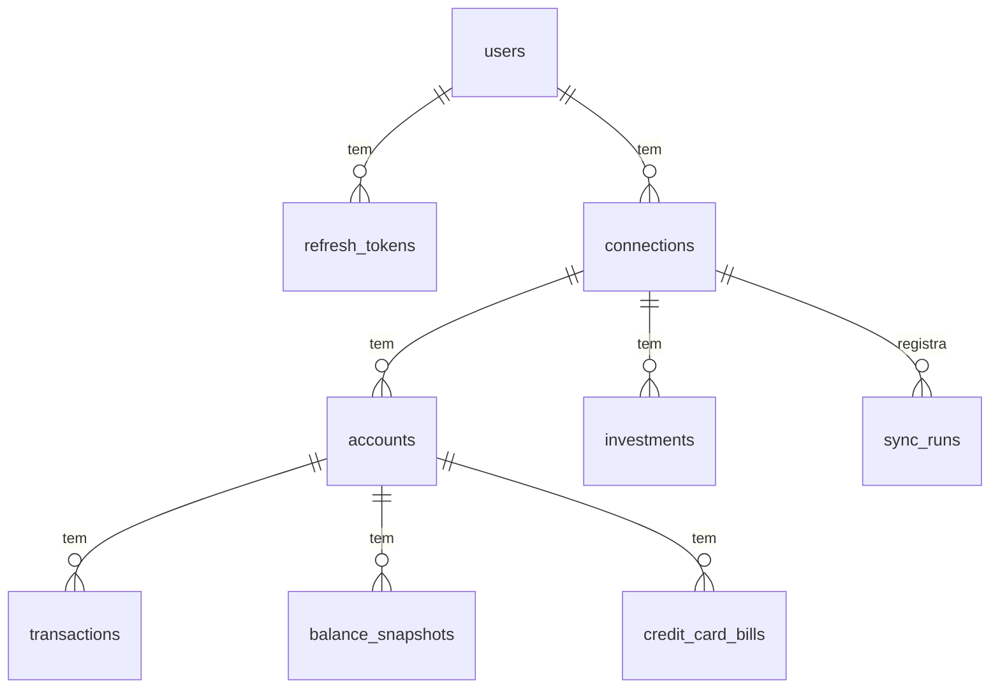

# Modelo de Dados

PostgreSQL 18, migrations com **Flyway**, nomes em inglês. Dinheiro em
`NUMERIC(19,2)`, datas de negócio em `DATE`, carimbos em `TIMESTAMPTZ`.

## Tabelas

**users** — `id uuid`, `email` (único, minúsculo), `password_hash`, `display_name`,
`failed_login_count`, `locked_until`, `created_at`.

**refresh_tokens** — `id`, `user_id`, `token_hash` (SHA-256, nunca o token puro),
`family_id`, `expires_at`, `rotated_at`, `revoked_at`, `created_at`. Ver
[[Autenticação]].

**connections** — `id`, `user_id` (FK `users`, cascata), `provider` (`PLUGGY`),
`provider_item_id` (único por provedor), `institution_name`, `institution_image_url`,
`status` (`ACTIVE`, `SYNCING`, `NEEDS_ATTENTION`), `provider_updated_at`,
`last_synced_at`, `consent_expires_at`, `created_at`, `updated_at`. Desvincular
apaga a linha, e a cascata leva tudo o que foi sincronizado.

**accounts** — `id`, `connection_id` (FK, cascata), `user_id`,
`provider_account_id` (único por conexão), `kind` (`CHECKING`, `SAVINGS`,
`CREDIT_CARD`, `OTHER`), `name`, `number_last_digits`, `currency_code`, `balance`,
`credit_limit`, `available_credit`, `created_at`, `updated_at`.

> [!note] `user_id` repetido
> Contas, transações e investimentos guardam `user_id`, mesmo alcançável pela conexão.
> Toda leitura filtra pelo dono num índice, sem fazer join com a tabela de outro módulo.

**balance_snapshots** — `account_id`, `snapshot_date`, `balance`. Chave
(`account_id`, `snapshot_date`). Um por dia, gravado na sincronização. É o que permite
o gráfico de patrimônio, porque o Open Finance não devolve saldo de dias passados.

**transactions** — `id`, `account_id`, `provider_transaction_id`,
`provider_reconcile_id`, `booked_on`, `description` (**criptografada**), `amount`
(sempre positivo), `direction` (`INFLOW`/`OUTFLOW`), `status`
(`PENDING`/`POSTED`), `category`, `installment_number`, `installment_total`,
`provider_bill_id`, `deleted_at`, `created_at`, `updated_at`. Único
(`account_id`, `provider_transaction_id`). Índices (`account_id`, `booked_on`) e
(`user_id`, `booked_on`) só das não removidas. `description` é `VARCHAR(2000)`, porque
o texto cifrado em base64 ocupa mais que o original.

**credit_card_bills** — `id`, `account_id`, `provider_bill_id` (único), `due_date`,
`total_amount`, `minimum_payment`, `currency_code`.

**investments** — `id`, `connection_id`, `provider_investment_id` (único), `kind`
(`FIXED_INCOME`, `TREASURY`, `FUND`, `EQUITY`, `OTHER`), `name`, `balance`,
`amount_invested`, `due_date`, `closed_at`, `updated_at`.

**sync_runs** — `id`, `connection_id`, `trigger` (`INITIAL`, `SCHEDULED`, `MANUAL`,
`WEBHOOK`), `status` (`RUNNING`, `SUCCEEDED`, `SKIPPED`, `FAILED`), `error_code`,
`started_at`, `finished_at`, `accounts_count`, `transactions_upserted`,
`transactions_deleted`. Índice único parcial: uma `RUNNING` por conexão. Ver
[[Sincronização]].

> [!warning] Validação do Hibernate
> `ddl-auto: validate` recusa `CHAR(n)` e `TEXT` onde a entidade tem `String`, porque
> espera `VARCHAR`. Por isso o schema usa `VARCHAR` em tudo, até em `currency_code`.

## Criptografia de coluna

- `transactions.description` passa por um `AttributeConverter` com **AES-256-GCM**;
  a chave vem de `WALLET_DATA_KEY`. O valor gravado leva um prefixo de versão da chave
  (`v1:`) para permitir rotação.
- Sem chave configurada, o core usa uma temporária e avisa no log. Um valor que não
  decifra (gravado com outra chave) volta como `null` em vez de derrubar a leitura.
- Valor, data, direção e categoria ficam abertos: são o que as somas e os gráficos
  usam.
- Consequência: a busca por texto no extrato não roda em SQL. O core filtra em
  memória dentro do período pedido (um mês de uma pessoa tem centenas de linhas).

## Exclusão

- Transação que some da Pluggy recebe `deleted_at` (soft delete): a Pluggy pode apagar
  e recriar a mesma transação com outro ID. Ver [[Sincronização]].
- Excluir a conta do usuário (LGPD) apaga tudo em cascata, inclusive as conexões.

Ver também [[Core]].
