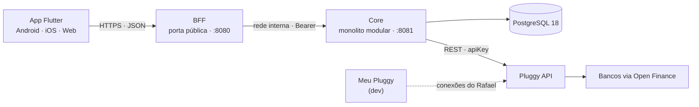

# Visão Geral



Detalhes em [[BFF]], [[Core]], [[App Flutter]], [[Modelo de Dados]],
[[Sincronização]] e [[Autenticação]].

## Quem faz o quê

| Serviço | Dono de | Nunca faz |
|---|---|---|
| **App** | Telas, sessão local, biometria | Falar com o core ou com a Pluggy |
| **BFF** | Porta pública, sessão por plataforma, rotas por tela, cache curto, limites | Guardar dado de negócio, falar com a Pluggy |
| **Core** | Usuários, dados financeiros, regras, sincronização, chave da Pluggy | Ficar exposto à internet, saber de cookie |

## Princípios

1. **Só o BFF é público.** O core e o banco ficam numa rede interna. A chave da Pluggy
   e os dados sincronizados estão duas camadas atrás da internet.
2. **O core guarda uma cópia dos dados.** Ler a Pluggy a cada tela seria lento,
   custaria requisição no plano pago e não daria histórico (o Open Finance não
   entrega saldo de dias passados). A cópia é sincronizada em segundo plano.
3. **O provedor é trocável.** A Pluggy fica atrás de uma porta
   (`FinancialDataProvider`); o resto do sistema só conhece os modelos do Wallet. Ver
   [[Risco Regulatório 2026]].
4. **Só leitura no v1.** O Meu Pluggy não inicia pagamento, e o escopo do v1 é ver as
   finanças. Pix fica para depois.
5. **Dinheiro nunca é `double`.** `BigDecimal` no Java, `NUMERIC(19,2)` no banco,
   string no JSON e `Decimal` no Dart.
6. **Código em inglês, tela em português.** Tabelas, colunas, enums e JSON em inglês;
   o texto que o usuário lê vem dos arquivos de tradução do app.

## Repositório

Um repositório só, como no TLT, porque é um produto de uma pessoa:

```
Work/Wallet/
  Docs/   cofre Obsidian (este)
  bff/    Spring Boot (Maven) · porta 8080
  core/   Spring Boot (Maven) · porta 8081
  app/    Flutter (android, ios, web)
```

`bff/` e `core/` são projetos Maven independentes, cada um com seu `mvnw` (sem POM
agregador na raiz).

## Ambientes

| | Desenvolvimento (agora) | Produção (depois) |
|---|---|---|
| Provedor | Meu Pluggy (grátis) | Pluggy plano Dados |
| Como a conta é conectada | No Meu Pluggy; o item é vinculado no Wallet pelo `itemId` | Widget Pluggy Connect no celular |
| Atualização | Polling a cada 6 h (a Pluggy atualiza a cada 24 h) | Polling + webhooks |
| Rede | BFF e core no localhost | Só o BFF atrás do HTTPS; core e banco em rede interna |
| Banco | Postgres 18 nativo na 5432 | Postgres gerenciado ou em container |
| Quem usa | Só o Rafael | Qualquer usuário |

O modo é escolhido por configuração no core (`wallet.provider.connection-mode`:
`MEU_PLUGGY` ou `PLUGGY_CONNECT`). Ver [[Meu Pluggy no Desenvolvimento]] e
[[Fluxo de Conexão]].
